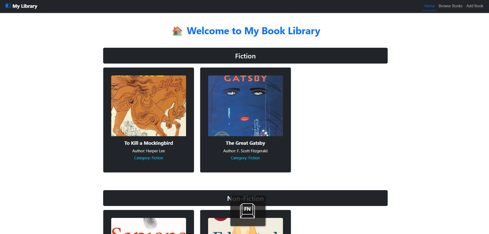
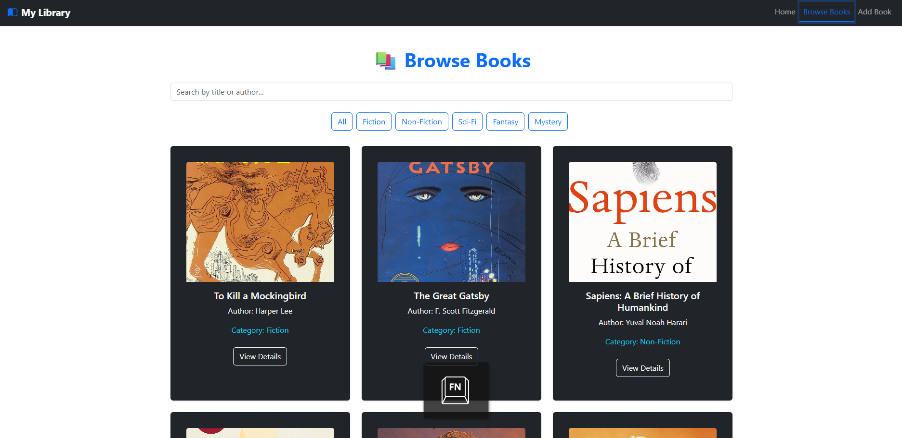
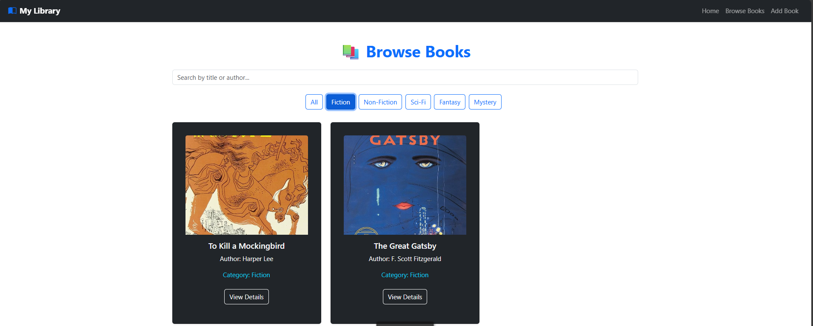
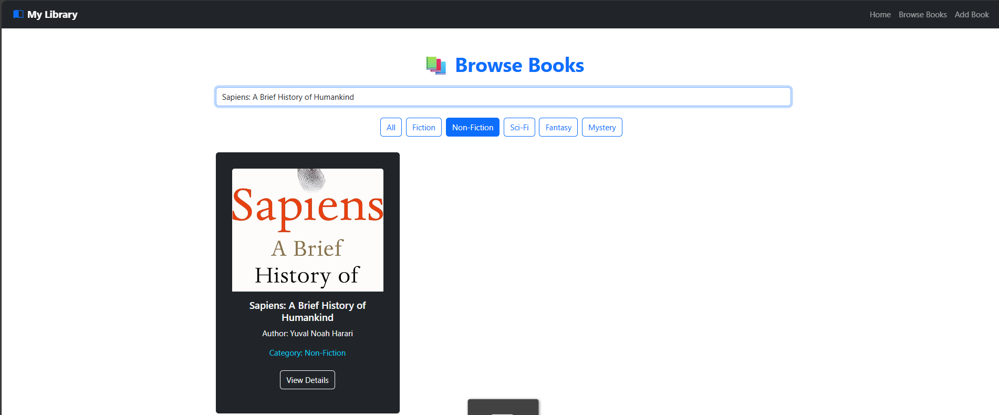
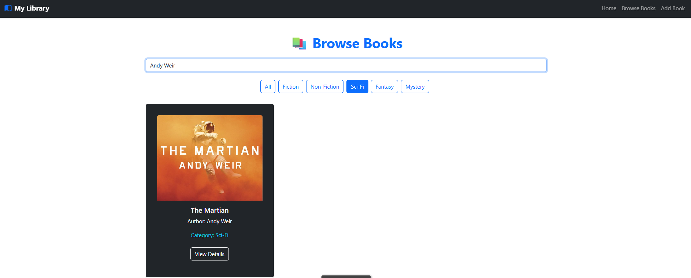
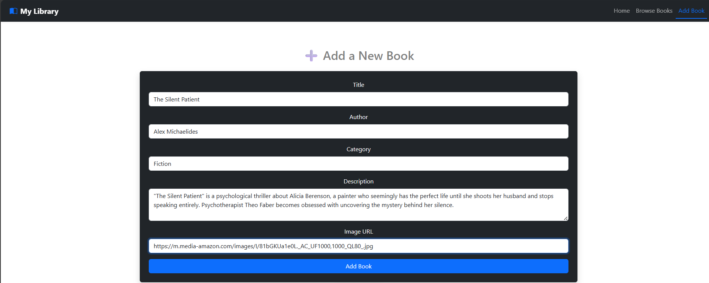
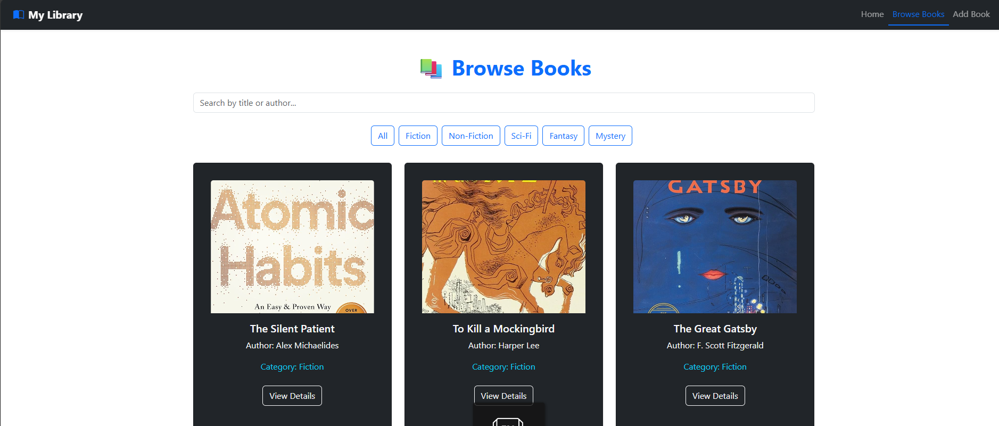
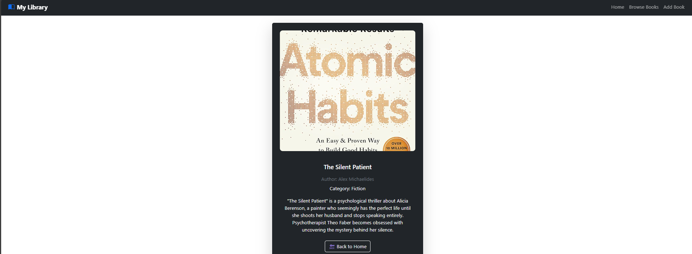
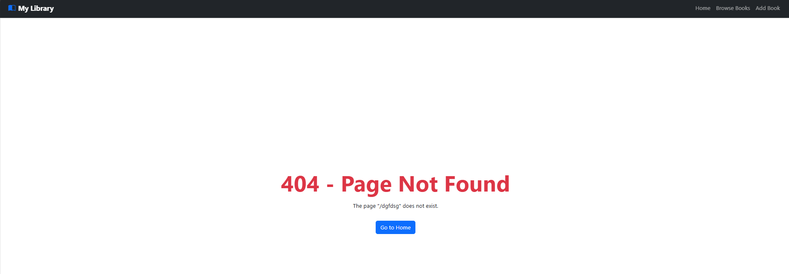

**📚 My Book Library (React + Redux Project)**

🧩 Description

My Book Library is a React-based web application for managing and browsing a collection of books.
Users can:

Browse books by category (Fiction, Non-Fiction, Sci-Fi, etc.)

View book details including title, author, description, and image

Add new books through a validated form

Filter and search books by category, title, or author

Handle invalid routes gracefully with a custom 404 Page

This project demonstrates concepts of React Router, Redux Toolkit, state management, props, event handling, and Bootstrap UI styling.

**🚀 Features**

✅ Dynamic book listing with filtering by category
✅ Add, view, and browse books using Redux state
✅ Search books by title or author
✅ Dynamic routing with /books/:id and /books/:category
✅ Custom “Page Not Found” (404) route
✅ Fully responsive, dark-themed Bootstrap UI

**🛠️ Technologies Used**

⚛️ React (Vite)

🧭 React Router DOM

🧰 Redux Toolkit

💅 Bootstrap 5

🪄 JavaScript (ES6+)

🖼️ Vite (for fast development and builds)

**📁 Project Structure**
src/
│
├── components/
│   ├── Header.jsx
│
├── pages/
│   ├── Home.jsx
│   ├── BrowseBooks.jsx
│   ├── AddBook.jsx
│   ├── BookDetails.jsx
│   ├── NotFound.jsx
│
├── redux/
│   ├── store.js
│   ├── booksSlice.js
│
├── App.jsx
├── main.jsx
└── index.css

**⚙️ Installation & Setup**

Follow these steps to run the project locally 👇

1️⃣ Clone the Repository
git clone https://github.com/anistars/online-book-store.git

2️⃣ Navigate into the Project Folder
cd online-book-store

3️⃣ Install Dependencies
npm install

4️⃣ Run the Development Server
npm run dev

Now open the URL shown in the terminal (usually http://localhost:5173).

**Usage Guide**

Home Page: Displays all books grouped by category.

Browse Books: Filter and search through the collection.

Add Book: Submit a new book via a form (validated inputs).

Book Details: Click any book card to view detailed info.

404 Page: Handles any undefined routes and offers a link back to Home.
